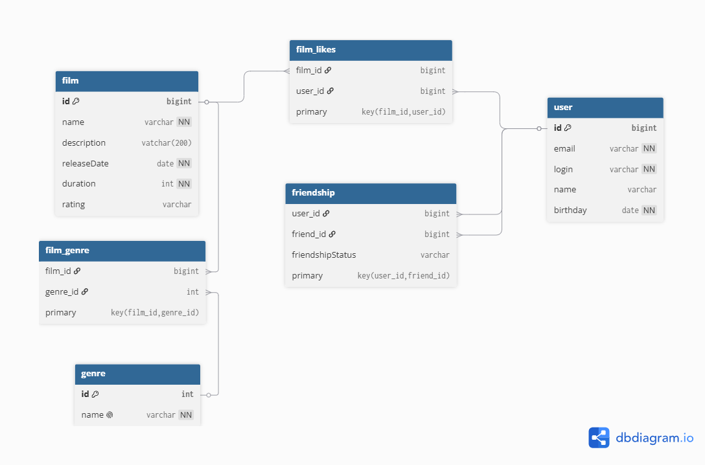

# java-filmorate
## Схема базы данных:

### Описание схемы:
- **film** - хранит информацию о фильмах
- **user** - хранит информацию о пользователях
- **genre** - справочник жанров
- **film_genre** - связь фильмов с жанрами
- **film_likes** - связь пользователей с фильмами, которые им понравились
- **friendship** - отношения дружбы между пользователями

### Примеры запросов
1. **Получение всех фильмов**
```sql
SELECT * FROM film;
```
2. **Получение пользователя по id**
```sql
SELECT * FROM user WHERE id = ?;
   ```
3. **Добавление лайка**
```sql
INSERT INTO film_likes (film_id, user_id) VALUES (?, ?);
```
4. **Топ-10 фильмов по лайкам**
```sql
SELECT f.name 
FROM film AS f
JOIN film_likes AS fl ON f.id = fl.film_id
GROUP BY f.name, f.id
ORDER BY COUNT(fl.user_id) DESC
LIMIT 10;
```
5. **Общие друзья пользователей 1 и 2**
```sql
SELECT u.id, u.name 
FROM friendship AS f1
JOIN friendship AS f2 ON f1.user_id = f2.user_id
JOIN user AS u ON u.id = f1.friend_id
WHERE f1.user_id = 1 AND f2.user_id = 2;
```

